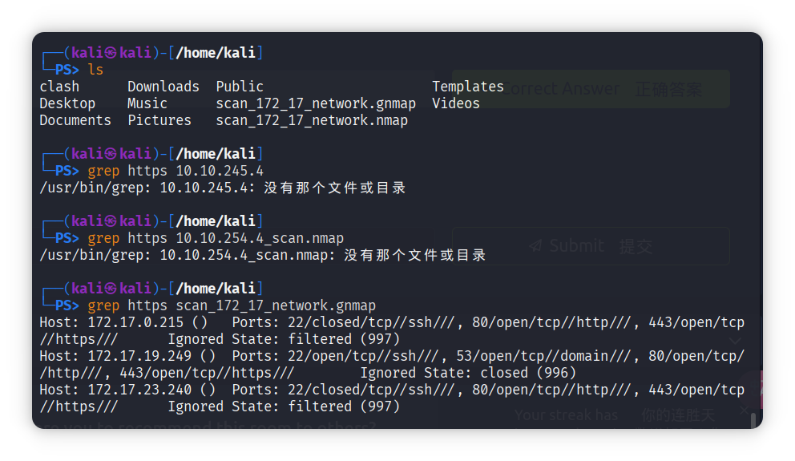

[TOC]


## 服务检测

​	一旦 Nmap 发现开放端口，您可以探测可用端口以检测运行的服务。对开放端口的进一步调查是重要的信息，因为渗透测试人员可以利用它来了解服务是否存在已知漏洞。加入漏洞基础课程以了解更多关于搜索易受攻击服务的内容。

​	在您的 Nmap 命令中**添加` -sV `将收集并确定开放端口的服务和版本信息**。您可以**通过` --version-intensity LEVEL `控制强度**，级别范围从 0（最轻）到 9（最完整）。 `-sV --version-light `的强度为 2，而 `-sV --version-all `的强度为 9。

​	使用`-sV`将**强制Nmap进行TCP三次握手并建立连接**。连**接的建立是必要的**，因为 **Nmap 无法在未完全建立连接并与监听服务通信的情况下发现版本**。换句话说，当**选择`-sV`选项时，隐蔽的 SYN 扫描 `-sS` 是不可能的**。

下面的控制台输出显示了一个**使用` -sV `选项的简单 Nmap 隐蔽 SYN 扫描**。添加 `-sV `选项会**在输出中新增一列，显示每个检测到的服务的版本信息**。例如，在 TCP 端口 22 开放的情况下，不是显示 `22/tcp open ssh `，而是显示 `22/tcp open ssh OpenSSH 6.7p1 Debian 5+deb8u8 (protocol 2.0)` 。注意，SSH 协议被猜测为服务，因为 TCP 端口 22 是开放的；Nmap 不需要连接端口 22 来确认。然而，**` -sV `需要连接到这个开放端口以获取服务横幅和任何它能获取的版本信息**，比如 `nginx 1.6.2 `。因此，**与服务列不同，版本列不是猜测**。

```cmd
pentester@TryHackMe$ sudo nmap -sV 10.10.109.88
Starting Nmap 7.60 ( https://nmap.org ) at 2021-09-10 05:03 BST
Nmap scan report for 10.10.109.88
Host is up (0.0040s latency).
Not shown: 995 closed ports
PORT    STATE SERVICE VERSION
22/tcp  open  ssh     OpenSSH 6.7p1 Debian 5+deb8u8 (protocol 2.0)
25/tcp  open  smtp    Postfix smtpd
80/tcp  open  http    nginx 1.6.2
110/tcp open  pop3    Dovecot pop3d
111/tcp open  rpcbind 2-4 (RPC #100000)
MAC Address: 02:A0:E7:B5:B6:C5 (Unknown)
Service Info: Host:  debra2.thm.local; OS: Linux; CPE: cpe:/o:linux:linux_kernel

Service detection performed. Please report any incorrect results at https://nmap.org/submit/ .
Nmap done: 1 IP address (1 host up) scanned in 8.40 seconds

        
```


## OS Detection  操作系统检测

​	Nmap 可以根据操作系统（OS）的行为及其响应中的任何明显特征来检测操作系统。可以使用 **-O 启用操作系统检测**；这里的 -O 是大写字母 O，**代表 OS**。在此示例中，我们在 AttackBox 上运行了 `nmap -sS -O 10.10.109.88` 。Nmap 检测到操作系统为 Linux 3.X，然后进一步猜测其运行的是内核 3.13。

```cmd
pentester@TryHackMe$ sudo nmap -sS -O 10.10.109.88
Starting Nmap 7.60 ( https://nmap.org ) at 2021-09-10 05:04 BST
Nmap scan report for 10.10.109.88
Host is up (0.00099s latency).
Not shown: 994 closed ports
PORT    STATE SERVICE
22/tcp  open  ssh
25/tcp  open  smtp
80/tcp  open  http
110/tcp open  pop3
111/tcp open  rpcbind
143/tcp open  imap
MAC Address: 02:A0:E7:B5:B6:C5 (Unknown)
Device type: general purpose
Running: Linux 3.X
OS CPE: cpe:/o:linux:linux_kernel:3.13
OS details: Linux 3.13
Network Distance: 1 hop

OS detection performed. Please report any incorrect results at https://nmap.org/submit/ .
Nmap done: 1 IP address (1 host up) scanned in 3.91 seconds
```

​	我们扫描并尝试检测其操作系统版本的系统运行的是内核版本 3.16。Nmap 在这种情况下能够做出较为准确的猜测。在另一个案例中，我们扫描了一个内核版本为 5.13.14 的 Fedora Linux 系统；然而，Nmap 检测为 Linux 2.6.X。好消息是 Nmap 正确检测到了操作系统；不太好的消息是内核版本错误。


​	**操作系统检测非常方便，但许多因素可能影响其准确性**。首先，Nmap 需要在目标上至少找到一个开放端口和一个关闭端口，才能做出可靠的猜测。此外，**由于虚拟化和类似技术的日益普及**，**来宾操作系统的指纹可能会被扭曲**。因此，**操作系统版本信息应始终持保留态度看待**。


## Traceroute  路由跟踪

​	如果你想让 **Nmap 找到你和目标之间的路由器**，**只需添加 `--traceroute`** 。在以下示例中，Nmap 将 `traceroute `附加到其扫描结果中。请注意，Nmap 的` traceroute `与 Linux 和 macOS 上的 `traceroute `命令或 MS Windows 上的` tracert `命令略有不同。**标准的 `traceroute` 从一个低 TTL（生存时间）的数据包开始，并不断增加，直到达到目标。Nmap 的` traceroute` 则从一个高 TTL 的数据包开始，并不断减少。**

执行了 `nmap -sS --traceroute 10.10.109.88 `。我们可以看到**两者之间没有路由器/跳数，因为它们是直接连接**的。

```cmd
pentester@TryHackMe$ sudo nmap -sS --traceroute 10.10.109.88

Starting Nmap 7.60 ( https://nmap.org ) at 2021-09-10 05:05 BST
Nmap scan report for 10.10.109.88
Host is up (0.0015s latency).
Not shown: 994 closed ports
PORT    STATE SERVICE
22/tcp  open  ssh
25/tcp  open  smtp
80/tcp  open  http
110/tcp open  pop3
111/tcp open  rpcbind
143/tcp open  imap
MAC Address: 02:A0:E7:B5:B6:C5 (Unknown)

TRACEROUTE
HOP RTT     ADDRESS
1   1.48 ms 10.10.109.88

Nmap done: 1 IP address (1 host up) scanned in 1.59 seconds
```

> [!NOTE]
>
> 许多路由器被配置为不发送 ICMP 超时（Time-to-Live exceeded）消息，这会阻止我们发现它们的 IP 地址。


## Nmap脚本引擎(NSE)

​	**脚本是一段不需要编译的代码**。换句话说，它保持原始的人类可读形式，不需要转换为机器语言。**许多程序通过脚本提供额外的功能**；此外，**脚本使得添加内置命令中不存在的自定义功能成为可能**。同样，**Nmap 通过使用 Lua 语言支持脚本**。作为 Nmap 的一部分，**Nmap 脚本引擎（NSE）是一个 Lua 解释器，允许 Nmap 执行用 Lua 语言编写的 Nmap 脚本。**然而，我们不需要学习 Lua 就能使用 Nmap 脚本。

​	**Nmap 默认安装中可能包含接近 600 个脚本**,查看你的 Nmap 安装文件夹。在 AttackBox 上，检查` /usr/share/nmap/scripts `处的文件，你会注意到有数百个脚本，方便地以它们所针对的协议开头命名。我们在下面的控制台输出中列出了 AttackBox 上所有以 HTTP 开头的脚本；我们发现大约有 130 个以 http 开头的脚本。随着未来的更新，你只能期待安装的脚本数量会增加。

```cmd
pentester@AttackBox /usr/share/nmap/scripts# ls http*
http-adobe-coldfusion-apsa1301.nse      http-passwd.nse
http-affiliate-id.nse                   http-php-version.nse
http-apache-negotiation.nse             http-phpmyadmin-dir-traversal.nse
http-apache-server-status.nse           http-phpself-xss.nse
http-aspnet-debug.nse                   http-proxy-brute.nse
http-auth-finder.nse                    http-put.nse
http-auth.nse                           http-qnap-nas-info.nse
http-avaya-ipoffice-users.nse           http-referer-checker.nse
http-awstatstotals-exec.nse             http-rfi-spider.nse
http-axis2-dir-traversal.nse            http-robots.txt.nse
http-backup-finder.nse                  http-robtex-reverse-ip.nse
http-barracuda-dir-traversal.nse        http-robtex-shared-ns.nse
http-brute.nse                          http-security-headers.nse
http-cakephp-version.nse                http-server-header.nse
http-chrono.nse                         http-shellshock.nse
http-cisco-anyconnect.nse               http-sitemap-generator.nse
http-coldfusion-subzero.nse             http-slowloris-check.nse
http-comments-displayer.nse             http-slowloris.nse
http-config-backup.nse                  http-sql-injection.nse
http-cookie-flags.nse                   http-stored-xss.nse
http-cors.nse                           http-svn-enum.nse
http-cross-domain-policy.nse            http-svn-info.nse
http-csrf.nse                           http-title.nse
http-date.nse                           http-tplink-dir-traversal.nse
http-default-accounts.nse               http-trace.nse
http-devframework.nse                   http-traceroute.nse
http-dlink-backdoor.nse                 http-unsafe-output-escaping.nse
http-dombased-xss.nse                   http-useragent-tester.nse
http-domino-enum-passwords.nse          http-userdir-enum.nse
http-drupal-enum-users.nse              http-vhosts.nse
http-drupal-enum.nse                    http-virustotal.nse
http-enum.nse                           http-vlcstreamer-ls.nse
http-errors.nse                         http-vmware-path-vuln.nse
http-exif-spider.nse                    http-vuln-cve2006-3392.nse
http-favicon.nse                        http-vuln-cve2009-3960.nse
http-feed.nse                           http-vuln-cve2010-0738.nse
http-fetch.nse                          http-vuln-cve2010-2861.nse
http-fileupload-exploiter.nse           http-vuln-cve2011-3192.nse
http-form-brute.nse                     http-vuln-cve2011-3368.nse
http-form-fuzzer.nse                    http-vuln-cve2012-1823.nse
http-frontpage-login.nse                http-vuln-cve2013-0156.nse
http-generator.nse                      http-vuln-cve2013-6786.nse
http-git.nse                            http-vuln-cve2013-7091.nse
http-gitweb-projects-enum.nse           http-vuln-cve2014-2126.nse
http-google-malware.nse                 http-vuln-cve2014-2127.nse
http-grep.nse                           http-vuln-cve2014-2128.nse
http-headers.nse                        http-vuln-cve2014-2129.nse
http-huawei-hg5xx-vuln.nse              http-vuln-cve2014-3704.nse
http-icloud-findmyiphone.nse            http-vuln-cve2014-8877.nse
http-icloud-sendmsg.nse                 http-vuln-cve2015-1427.nse
http-iis-short-name-brute.nse           http-vuln-cve2015-1635.nse
http-iis-webdav-vuln.nse                http-vuln-cve2017-1001000.nse
http-internal-ip-disclosure.nse         http-vuln-cve2017-5638.nse
http-joomla-brute.nse                   http-vuln-cve2017-5689.nse
http-litespeed-sourcecode-download.nse  http-vuln-cve2017-8917.nse
http-ls.nse                             http-vuln-misfortune-cookie.nse
http-majordomo2-dir-traversal.nse       http-vuln-wnr1000-creds.nse
http-malware-host.nse                   http-waf-detect.nse
http-mcmp.nse                           http-waf-fingerprint.nse
http-method-tamper.nse                  http-webdav-scan.nse
http-methods.nse                        http-wordpress-brute.nse
http-mobileversion-checker.nse          http-wordpress-enum.nse
http-ntlm-info.nse                      http-wordpress-users.nse
http-open-proxy.nse                     http-xssed.nse
http-open-redirect.nse
```


​	您可以指定使用任何一个或一组已安装的脚本；此外，您还可以安装其他用户的脚本并将其用于扫描。让我们从默认脚本开始。您可以选**择使用` --script=default `运行默认类别中的脚本**，或者**简单地添加 `-sC `**。除了默认类别外，类别还包括 auth、broadcast、brute、default、discovery、dos、exploit、external、fuzzer、intrusive、malware、safe、version 和 vuln。以下表格中显示了简要说明。


| Script Category  脚本类别 |                  Description  描述                   |
| :-----------------------: | :--------------------------------------------------: |
|           auth            |                     认证相关脚本                     |
|         broadcast         |               通过发送广播消息发现主机               |
|           brute           |              对登录执行暴力破解密码审计              |
|          default          |               默认脚本，与 `-sC `相同                |
|         discovery         |       检索可访问的信息，如数据库表和 DNS 名称        |
|            dos            |         检测易受拒绝服务（DoS）攻击的服务器          |
|          exploit          |              尝试利用各种易受攻击的服务              |
|         external          | 使用第三方服务进行检查，例如 Geoplugin 和 Virustotal |
|          fuzzer           |       Launch fuzzing attacks  发起模糊测试攻击       |
|         intrusive         |           侵入性脚本，如暴力破解攻击和利用           |
|          malware          |                       扫描后门                       |
|           safe            |              不会导致目标崩溃的安全脚本              |
|          version          |                     检索服务版本                     |
|           vuln            |             检查漏洞或利用易受攻击的服务             |

有些脚本属于多个类别。此外，**有些脚本对服务发起暴力破解攻击，而其他脚本则发起拒绝服务（DoS）攻击并利用系统漏洞**。因此，如果您不想导致服务崩溃或被利用，选择运行脚本时务必小心。


我们使用 Nmap 对 `10.10.109.88` 运行 SYN 扫描，并在下面显示的控制台中执行默认脚本。命令是 `sudo nmap -sS -sC 10.10.109.88 `，其中 `-sC `将确保 Nmap 在 SYN 扫描后执行默认脚本。下面出现了新的细节。看看端口 22 的 SSH 服务；Nmap 恢复了与运行服务器相关的所有四个公钥。再看另一个例子，端口 80 的 HTTP 服务；Nmap 检索了默认的页面标题。我们可以看到该页面仍然是默认状态。

```powershell
pentester@TryHackMe$ sudo nmap -sS -sC 10.10.109.88

Starting Nmap 7.60 ( https://nmap.org ) at 2021-09-10 05:08 BST
Nmap scan report for ip-10-10-161-170.eu-west-1.compute.internal (10.10.161.170)
Host is up (0.0011s latency).
Not shown: 994 closed ports
PORT    STATE SERVICE
22/tcp  open  ssh
| ssh-hostkey: 
|   1024 d5:80:97:a3:a8:3b:57:78:2f:0a:78:ae:ad:34:24:f4 (DSA)
|   2048 aa:66:7a:45:eb:d1:8c:00:e3:12:31:d8:76:8e:ed:3a (RSA)
|   256 3d:82:72:a3:07:49:2e:cb:d9:87:db:08:c6:90:56:65 (ECDSA)
|_  256 dc:f0:0c:89:70:87:65:ba:52:b1:e9:59:f7:5d:d2:6a (EdDSA)
25/tcp  open  smtp
|_smtp-commands: debra2.thm.local, PIPELINING, SIZE 10240000, VRFY, ETRN, STARTTLS, ENHANCEDSTATUSCODES, 8BITMIME, DSN, 
| ssl-cert: Subject: commonName=debra2.thm.local
| Not valid before: 2021-08-10T12:10:58
|_Not valid after:  2031-08-08T12:10:58
|_ssl-date: TLS randomness does not represent time
80/tcp  open  http
|_http-title: Welcome to nginx on Debian!
110/tcp open  pop3
|_pop3-capabilities: RESP-CODES CAPA TOP SASL UIDL PIPELINING AUTH-RESP-CODE
111/tcp open  rpcbind
| rpcinfo: 
|   program version   port/proto  service
|   100000  2,3,4        111/tcp  rpcbind
|   100000  2,3,4        111/udp  rpcbind
|   100024  1          38099/tcp  status
|_  100024  1          54067/udp  status
143/tcp open  imap
|_imap-capabilities: LITERAL+ capabilities IMAP4rev1 OK Pre-login ENABLE have LOGINDISABLEDA0001 listed SASL-IR ID more post-login LOGIN-REFERRALS IDLE
MAC Address: 02:A0:E7:B5:B6:C5 (Unknown)

Nmap done: 1 IP address (1 host up) scanned in 2.21 seconds
```


您也可以**使用 `--script "SCRIPT-NAME" `按名称指定脚本**，或使用诸如 `--script "ftp*" `之类的模式，这将包括 ftp-brute 。如果您不确定**脚本的功能**，可以**使用文本阅读器（如 less ）或文本编辑器打开脚本文件**。以` ftp-brute `为例，它说明：“对 FTP 服务器执行暴力密码审计。”您必须小心，因为有些脚本相当具有侵入性。此外，有些脚本可能针对特定服务器，如果随机选择，将浪费您的时间且无任何益处。像往常一样，确保您被授权在目标服务器上启动此类测试。

让我们考虑一个无害的脚本 `http-date `，我们猜测它会检索 HTTP 服务器的日期和时间，这在其描述中得到了确认：“从类似 HTTP 的服务获取日期。同时，它会打印日期与本地时间的差异……”在 AttackBox 上，我们执行了 `sudo nmap -sS -n --script "http-date" 10.10.109.88 `，如下方控制台所示。

最后，您可以扩展 Nmap 的功能，超出官方 Nmap 脚本的范围；您可以编写自己的脚本或从互联网上下载 Nmap 脚本。从互联网上下载并使用 Nmap 脚本存在一定的风险。因此，最好不要运行来自不信任作者的脚本。

[最后一题可以去尝试做做](https://tryhackme.com/room/nmap04)


## Saving the Output 保存输出

​	每当你运行 Nmap 扫描时，将结果保存到文件中是合理的。为文件名选择并采用良好的命名规范也至关重要。(**就是将文件进行保存，然后进行查看**)文件数量可能迅速增加，妨碍你查找之前的扫描结果。三种主要格式是：

- Normal  普通
- Grepable (grepable)  可 grep ( grep 可用)
- XML

### Normal  普通

顾名思义，**普通格式类似于扫描目标时屏幕上显示的输出**。您可以使用 `-oN FILENAME` 保存扫描结果为普通格式；N 代表普通。以下是结果示例

```powershell
pentester@TryHackMe$ cat MACHINE_IP_scan.nmap 
# Nmap 7.60 scan initiated Fri Sep 10 05:14:19 2021 as: nmap -sS -sV -O -oN MACHINE_IP_scan 10.10.133.191
Nmap scan report for 10.10.133.191
Host is up (0.00086s latency).
Not shown: 994 closed ports
PORT    STATE SERVICE VERSION
22/tcp  open  ssh     OpenSSH 6.7p1 Debian 5+deb8u8 (protocol 2.0)
25/tcp  open  smtp    Postfix smtpd
80/tcp  open  http    nginx 1.6.2
110/tcp open  pop3    Dovecot pop3d
111/tcp open  rpcbind 2-4 (RPC #100000)
143/tcp open  imap    Dovecot imapd
MAC Address: 02:A0:E7:B5:B6:C5 (Unknown)
Device type: general purpose
Running: Linux 3.X
OS CPE: cpe:/o:linux:linux_kernel:3.13
OS details: Linux 3.13
Network Distance: 1 hop
Service Info: Host:  debra2.thm.local; OS: Linux; CPE: cpe:/o:linux:linux_kernel

OS and Service detection performed. Please report any incorrect results at https://nmap.org/submit/ .
# Nmap done at Fri Sep 10 05:14:28 2021 -- 1 IP address (1 host up) scanned in 9.99 seconds
```


### Grepable  可 grep 的

​	grepable 格式的名称来源于命令 `grep` ；**`grep `代表全局正则表达式打印器**。简单来说，它**使得过滤扫描输出中特定关键词或术语变得高效**。您可以使用**` -oG FILENAME `将扫描结果保存为` grepable` 格式**。上面以普通格式显示的扫描输出，在下面的控制台中以 `grepable `格式显示。普通输出有 21 行；然而，`grepable `输出只有 4 行。主要原因是当用户应用 grep 时，Nmap 希望使每一行都具有意义且完整。因此，在 grepable 输出中，**行非常长，相较于普通输出不便于阅读**。

```powershell
pentester@TryHackMe$ cat MACHINE_IP_scan.gnmap 
# Nmap 7.60 scan initiated Fri Sep 10 05:14:19 2021 as: nmap -sS -sV -O -oG MACHINE_IP_scan 10.10.245.4
Host: 10.10.245.4	Status: Up
Host: 10.10.245.4	Ports: 22/open/tcp//ssh//OpenSSH 6.7p1 Debian 5+deb8u8 (protocol 2.0)/, 25/open/tcp//smtp//Postfix smtpd/, 80/open/tcp//http//nginx 1.6.2/, 110/open/tcp//pop3//Dovecot pop3d/, 111/open/tcp//rpcbind//2-4 (RPC #100000)/, 143/open/tcp//imap//Dovecot imapd/	Ignored State: closed (994)	OS: Linux 3.13	Seq Index: 257	IP ID Seq: All zeros
```


​	`grep` 的一个示例用法是 `grep KEYWORD TEXT_FILE` ；此命令将**显示所有包含提供的关键字的行**。让我们比较在**普通输出和可 grep 输出上使用 grep 的结果。你会注意到前者没有提供主机的 IP 地址**。相反，它返回了 `80/tcp open http nginx 1.6.2` ，这在你筛选多个系统的扫描结果时非常不便。然而，**后者在每一行中提供了足够的信息，如主机的 IP 地址，使其更加完整。**

```powershell
pentester@TryHackMe$ grep http MACHINE_IP_scan.nmap 
80/tcp  open  http    nginx 1.6.2
OS and Service detection performed. Please report any incorrect results at https://nmap.org/submit/ .
```

```powershell
pentester@TryHackMe$ grep http MACHINE_IP_scan.gnmap 
Host: 10.10.245.4	Ports: 22/open/tcp//ssh//OpenSSH 6.7p1 Debian 5+deb8u8 (protocol 2.0)/, 25/open/tcp//smtp//Postfix smtpd/, 80/open/tcp//http//nginx 1.6.2/, 110/open/tcp//pop3//Dovecot pop3d/, 111/open/tcp//rpcbind//2-4 (RPC #100000)/, 143/open/tcp//imap//Dovecot imapd/	Ignored State: closed (994)	OS: Linux 3.13	Seq Index: 257	IP ID Seq: All zeros
```


### XML

​	第三种格式是 XML。您可以使用 `-oX FILENAME `将扫描结果保存为 XML 格式。XML 格式在其他程序中处理输出时最为方便。更方便的是，您可以使用 `-oA FILENAME`结合 `-oN `、 `-oG` 和 `-oX` ，将扫描输出保存为普通格式、grepable 格式和 XML 格式三种格式。


### 答题：




