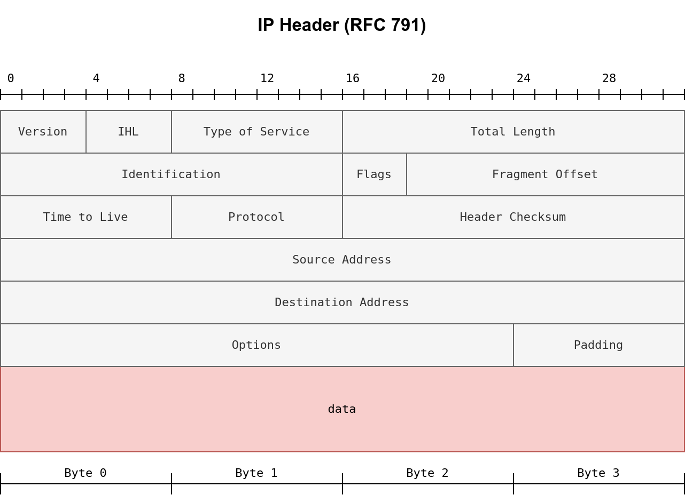

[TOC]

## Firewall 防火墙

​	防火墙是一种**允许数据包通过或阻止数据包的软件或硬件**。它基于防火墙规则运行，规则总结为**阻止所有流量但有例外**，或**允许所有流量但有例外。**

​	例如，您可能会阻止所有到服务器的流量，除了那些发送到您的网页服务器的流量。传统防火墙至少会检查 IP 头和传输层头。更复杂的防火墙还会尝试检查传输层携带的数据。

## IDS 入侵检测系统

​	入侵加测系统(IDS)**检查网络数据包中的特定行为模式或特定内容签名**。**每当满足恶意规则时，它会发出警报。**除了 **IP 头和传输层头**之外，IDS 还会**检查传输层中的数据内容**，并**检查是否匹配任何恶意模式**。如何**降低传统防火墙/IDS 检测到您的 Nmap 活动的可能性**？这个问题不容易回答；然而，根据防火墙/IDS 的类型，您可能会**通过将数据包拆分成更小的数据包来获益。**

## Fragmented Packets 分片数据包

​	Nmap 提供了**选项 `-f `来分片数据包**。选择后，**IP 数据将被分成不超过 8 字节的片段**。添加**另一个 -f （ -f -f 或 -ff ）将把数据分成 16 字节的片段，而不是 8 字节**。您可以**使用` --mtu `来更改默认值**；但是，您应**始终选择 8 的倍数**。

​	为了正确理解分片，我们需要查看下图中的 **IP 头部**。起初它可能看起来很复杂，但我们注意到我们知道它的大部分字段。特别是，注意**第四行中占用 32 位（4 字节）的源地址**，而**第五行中目的地址又占用了 4 字节**。我们将**跨多个数据包分片的数据用红色突出显示**。为了帮助接收方重新组装，IP 使用了标识符（ID）和分片偏移量，如下图第二行所示。

这是IPv4数据包首部的字段：
• Version：版本号，占4位，IPv4的值为4。

• IHL：首部长度，占4位，以4字节为单位，指出首部长度。

• Type of Service：服务类型，占8位，用于指定数据包的服务质量要求。

• Total Length：总长度，占16位，指首部和数据之和的长度。

• Identification：标识，占16位，用于分片重组。

• Flags：标志，占3位，用于控制分片。

• Fragment Offset：片偏移，占13位，指出分片在原分组中的相对位置。

• Time to Live：生存时间，占8位，限制数据包在网络中的生存时间。

• Protocol：协议，占8位，指出上层使用的协议。

• Header Checksum：首部校验和，占16位，对首部进行差错检测。

• Source Address：源地址，占32位，标识发送方IP地址。

• Destination Address：目的地址，占32位，标识接收方IP地址。

• Options：选项，长度可变，提供额外功能。

• Padding：填充，使首部长度为4字节的整数倍。

• data：数据，即上层协议的数据。

​	让我们比较运行 `sudo nmap -sS -p80 10.20.30.144 `和 `sudo nmap -sS -p80 -f 10.20.30.144` 。如你所知，这将对端口 80 使用隐蔽的 TCP SYN 扫描；然而，在第二个命令中，我们请求 **Nmap 对 IP 数据包进行分片**。

​	在前两行中，我们可以看到一个 ARP 查询和响应。Nmap 发出了 ARP 查询，因为目标在同一以太网上。接下来的两行显示了一个 TCP SYN ping 及其回复。**第五行是端口扫描的开始**；Nmap 向端口 80 发送了一个 TCP SYN 数据包。**在这种情况下，IP 头部为 20 字节，TCP 头部为 24 字节**。注意，**TCP 头部的最小大小是 20 字节**。

​	通过 `-f `请求分片，**TCP 头部的 24 字节将被划分为 8 字节的倍数，最后一个分片包含 8 字节或更少的 TCP 头部**。由于 **24 可以被 8 整除，我们得到了 3 个 IP 分片**；**每个分片包含 20 字节的 IP 头部和 8 字节的 TCP 头部**。我们可以在**第五行到第七行之间看到这三个分片**。

​	请注意，如果你添加了 `-ff （或 -f -f ）`，数据的分片将是 16 的倍数。换句话说，在这种情况下，TCP 头部的 **24 字节将被分成两个 IP 分片，第一个包含 16 字节，第二个包含 8 字节的 TCP 头部**。

​	另一方面，如果你想**增加数据包的大小**使其看起来无害，可以使用选项` --data-length NUM `，其中 **num 指定你想附加到数据包的字节数**。