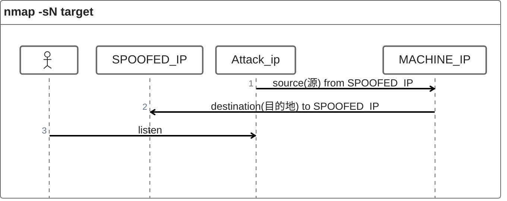
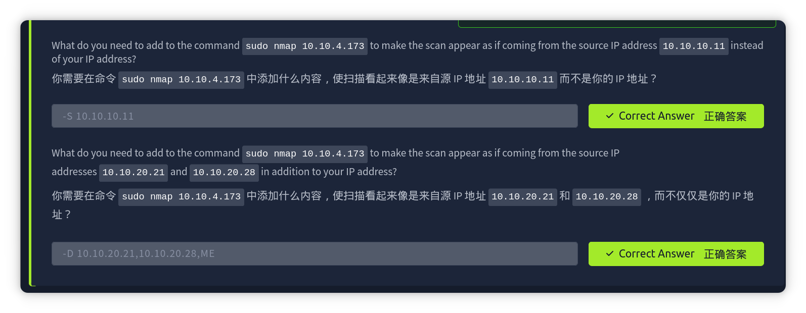

[TOC]

# spoofing and Decoys (欺骗和诱饵)

​	在某些网络设置中，**您可以使用伪造的 IP 地址甚至伪造的 MAC 地址扫描目标系统。**只有在**您能够保证捕获响应的情况下**，**这种扫描才有意义**。如果您**尝试从某个随机网络使用伪造的 IP 地址扫描目标**，您**很可能无法接收到任何响应**，**扫描结果可能不可靠**。

下图显示了攻击者发起命令`nmap -S SPOOFED_IP 10.10.4.173`。因此，nmap将使用提供的源IP地址`SPOOFED_IP`构造所有数据包。**目标机器将响应传入的数据包，并将回复发送到目标 IP 地址 SPOOFED_IP** 。**为了使此扫描工作并提供准确的结果**，**攻击者需要监控网络流量以分析回复**。

**summary : 使用 spoofed_ip 作为扫描的源 IP 地址**

### 使用伪造的 IP 地址进行扫描分为三步：

- 攻击者向目标及其发送一个伪造IP地址的数据包
- 目标机器将伪造的IP地址作为目的地
- 攻击者捕获回复以确定开放端口

## 重点: 

#### 	伪造攻击者

​	通常，您需要**使用` -e `指定网络接口**，并显式**禁用 ping 扫描` -Pn` 。因此，您需要**发出 `nmap -e NET_INTERFACE -Pn -S SPOOFED_IP 10.10.4.173`** 而不是 `nmap -S SPOOFED_IP 10.10.4.173 `，以**明确告诉 Nmap 使用哪个网络接口**，并且**不期望收到 ping 回复**。值得重复的是，==如果攻击者系统无法监控网络响应，则此扫描将毫无用处==。

#### 	伪造MAC地址（必须处于同一子网

​	当您与目标机器**处于同一子网时**，您也可以**伪造您的 MAC 地址**。您可以**使用 `--spoof-mac SPOOFED_MAC `指定源 MAC 地址**。只有**当攻击者和目标机器处于同一以太网（802.3）网络或同一` WiFi（802.11）`时，才可能进行此地址伪造**。(用法应该与IP伪造一样)

​	欺骗仅在满足某些条件的极少数情况下有效。因此，攻击者可能会**使用诱饵来增加被定位的难度**，其概念很简单，**使扫描看起来来自多个 IP 地址，从而使攻击者的 IP 地址淹没其中**。如下面图中所示，**目标机器的扫描将显示来自 3 个不同的来源**，因此，**回复也会发送给诱饵**。

### 躲藏

​	您可以通过在` -D `后指定特定或随机的 IP 地址来启动诱饵扫描。例如， `nmap -D 10.10.0.1,10.10.0.2,ME 10.10.4.173` 将使对 10.10.4.173 的扫描看起来来自 IP 地址 `10.10.0.1`、`10.10.0.2`，然后 **ME 表示您的 IP 地址应出现在第三个位置**。另一个示例命令是` nmap -D 10.10.0.1,10.10.0.2,RND,RND,ME 10.10.4.173 `，其中**第三和第四个源 IP 地址是随机分配的，而第五个源将是攻击者的 IP 地址**。换句话说，**每次执行后一个命令时，您都可以期望第三和第四个诱饵源是两个新的随机 IP 地址。**

