[TOC]


**标志在第四行，其中每个单个的都是**

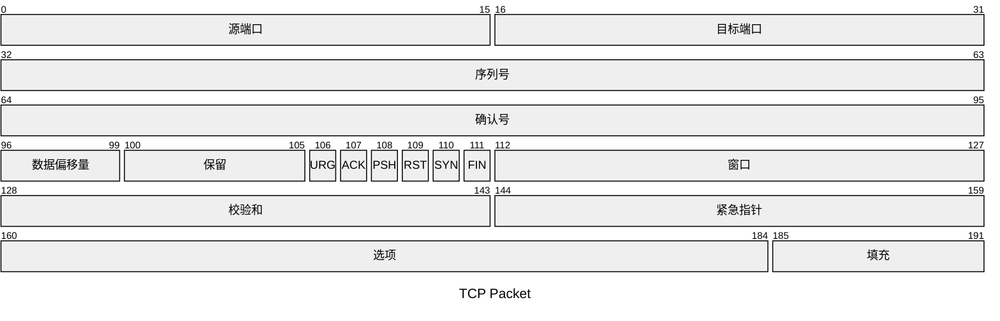

# 提示: 前三个可以进行端口探测，4-6可以进行防火墙规则猜测

# Null Scam 空扫描

​	空扫描==不会设置任何标志==；所有六个位标志都被设置为0。

​	使用`-sN`选项选择此扫描。一个==没有设置任何标志的TCP数据包==在==到达开放端口==时==不会触发任何响应==

从 Nmap 的角度来看，空扫描中**没有回复表示端口要么是开放**的，要么是**防火墙阻止了该数据包**。

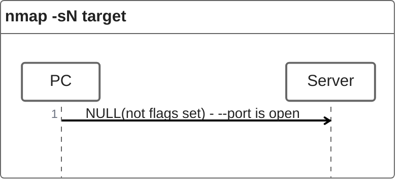

如果目标服务器在端口关闭时以RST数据包响应，则代表着端口关闭。

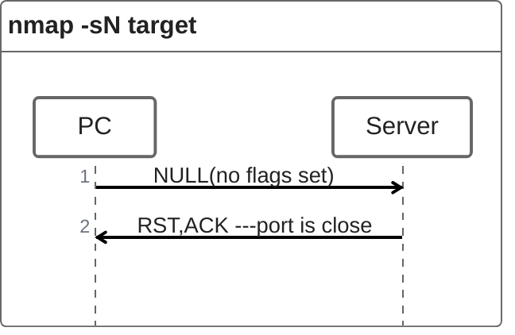

> [!NOTE]
>
> - #### 记得使用sudo或者root来获取权限。
>
> - #### 一些防火墙会“静默”丢弃流量而不发送 RST。

#### 

### 实例图：

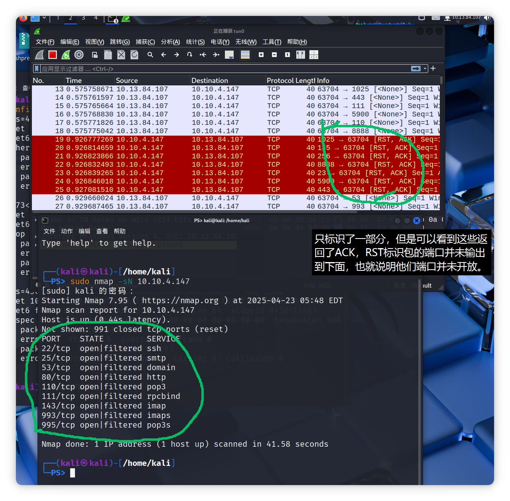

许多 Nmap 选项需要 root 权限。除非您以 root 身份运行 Nmap，否则您需要像上面示例中使用 -sN 选项那样使用 sudo 。


# FIN Scan FIN 扫描

### 	FIN标识数据包标识没有更多数据需要发送了。

​	FIN 扫描发送一个==设置了 FIN 标志的 TCP 数据包==。你可以使用 `-sF` 选项选择这种扫描类型。同样，如果 ==TCP 端口开==放，则==不会发送响应==。再次强调，**Nmap 无法确定端口是开放的还是防火墙阻止了与该 TCP 端口相关的流量。**

#### 下面两图分别展示了端口的两种情况:

##### port is open : 

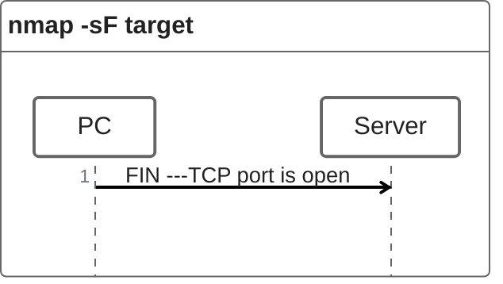

#### port is close : 

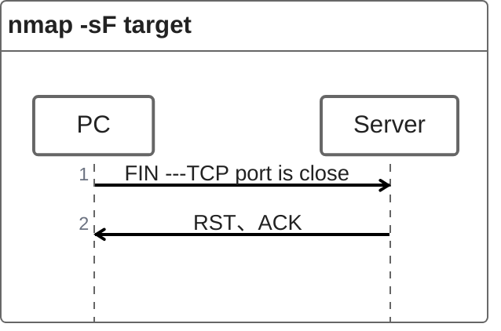

#### 一些防火墙会“静默”丢弃流量而不发送 RST


#### 下图展示了实际视图:

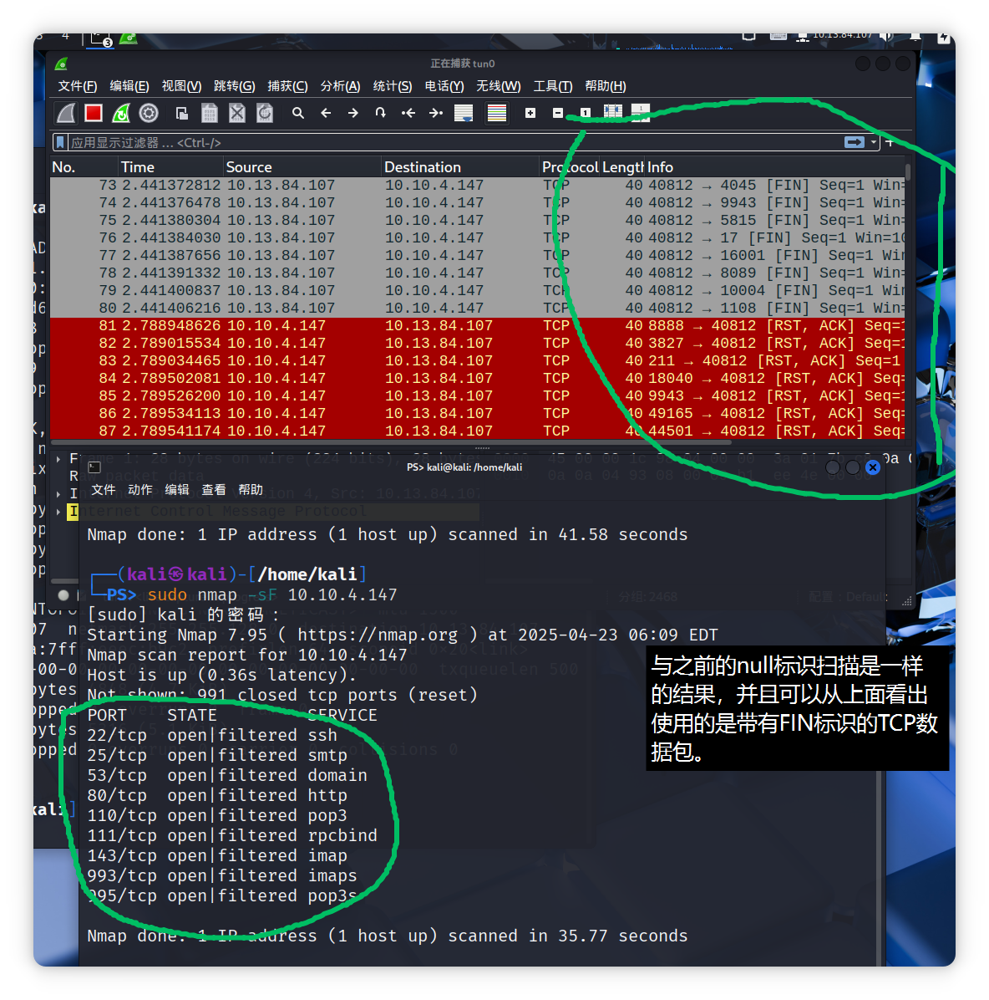


# Xmas Scan 圣诞扫描

​	Xmas 扫描的名称来源于圣诞树灯。==Xmas 扫描同时设置 FIN、PSH(推送) 和 URG 标志(紧急)==。您可以==使用选项 `-sX `选择 Xmas 扫描。==

​	与 Null 扫描和 FIN 扫描类似，如果收到 RST 数据包，表示端口已关闭。否则，将报告为开放|过滤状态。

### 下图展示了 TCP 端口开放和关闭的两种情况:

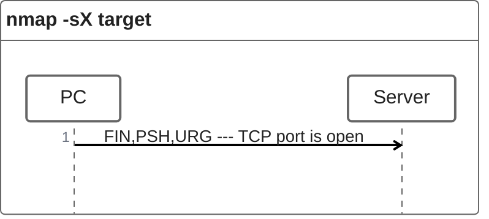

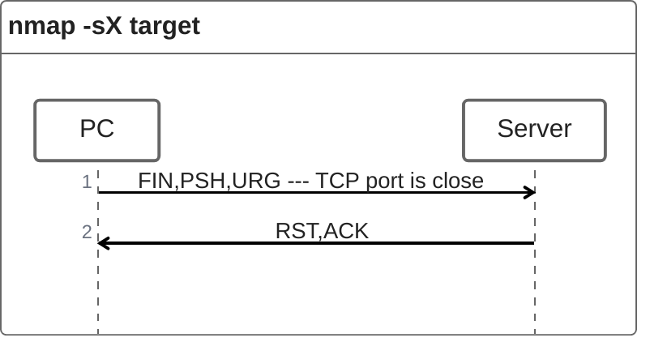

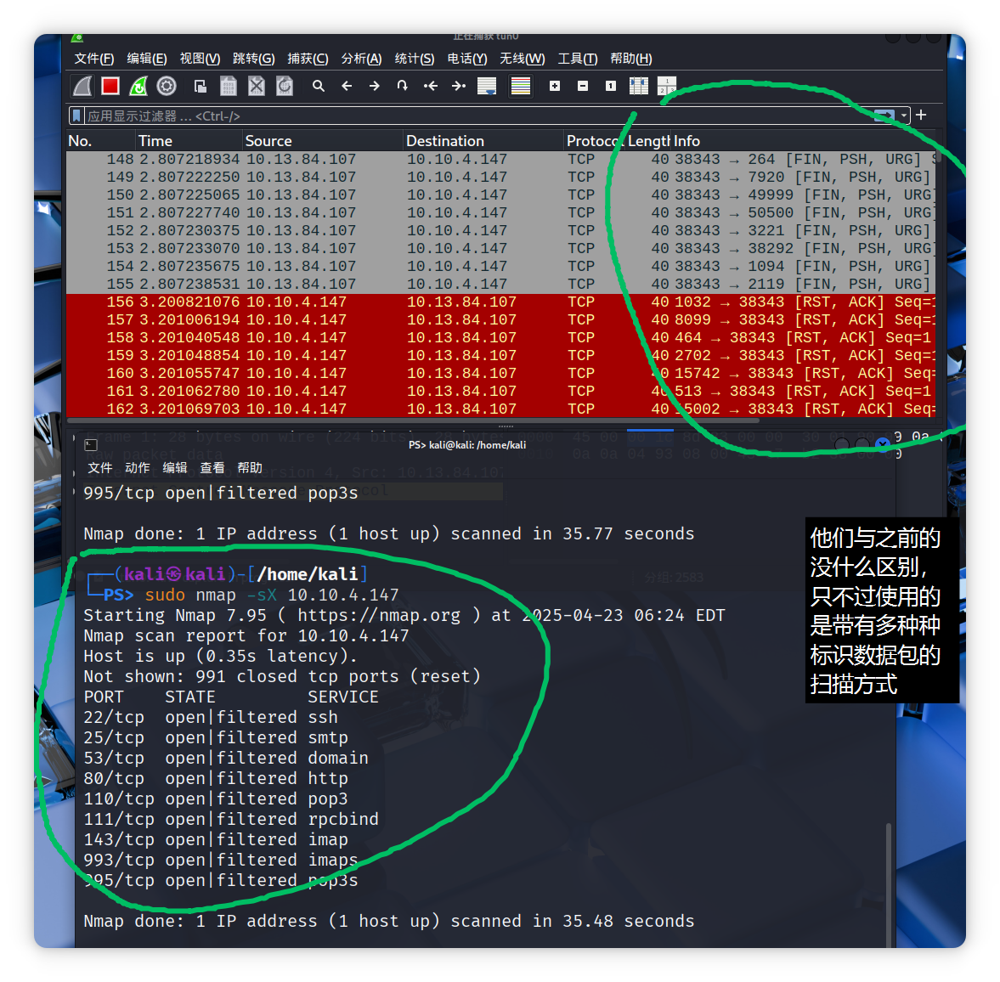


# 这三种扫描类型在扫描位于无状态（非有状态）防火墙后面的目标时可能高效。

## 无状态防火墙：	

- 无状态防火墙会检查传入的数据包是否设置了 SYN 标志，以检测连接尝试。

- 使用与 SYN 包不匹配的标志组合可以欺骗防火墙，从而到达其后的系统。

## 有状态防火墙

- 有状态防火墙几乎会阻止所有此类伪造的数据包，使这种扫描无效。


# TCP ACK Scan TCP ACK扫描

​	顾名思义，**ACK 扫描会发送一个设置了 ACK 标志的 TCP 数据包使用 `-sA` 选项来选择此扫描**如下面图中所示，**目标会无论端口状态如何**，**都以 RST 响应 ACK**。

这种行为的**原因**是，这句话描述了TCP协议中ACK标志的一种典型使用场景。

> [!IMPORTANT]
>
> ​	在TCP里，ACK（确认）标志用于表示接收方已成功接收数据。正常情况下，当一方（接收方）收到另一方（发送方）发来的TCP数据包后，如果该数据包中的数据被正确接收且无差错，接收方会设置ACK标志并发送一个确认数据包给发送方，以此告知对方数据已成功接收。
>
> 但**并非所有设置了ACK标志的数据包都严格遵循此规则**。不过从规范和常见情况来说，设置了ACK标志的TCP数据包主要就是用于响应收到的TCP数据包，确认某些数据的接收情况，这样能保证数据传输的可靠性和有序性。

此扫描无法告诉我们目标端口是否开放,但是**可以用于发现防火墙规则和配置。**

#### 下图为防火墙无状态时的图：

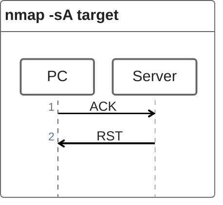

#### 下图为防火墙有状态的时候:

- The firewall does not set rules for this port(这个端口没有防火墙阻挡)


- Firewalls have rules for this port(防火墙对这个端口设置了规则)

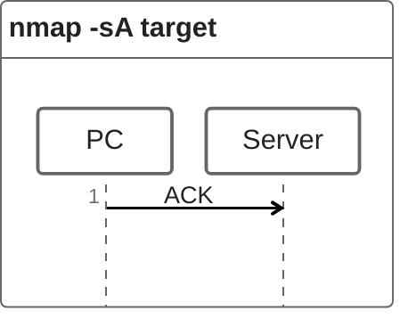

#### 实例图：

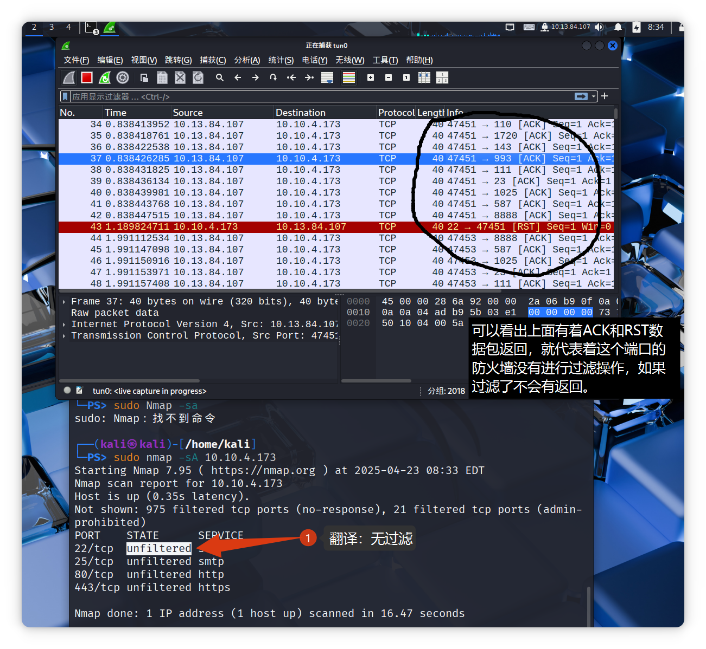


# Windows Scan 窗口扫描

**TCP 窗口扫描几乎与 ACK 扫描相同，它检查返回的 RST 包中的 TCP 窗口字段.**

- 在**特定系统**上，这可以揭示端口是否开放。

- 使用选项` -sW `选择此扫描类型

- 我们期望对我们的“未邀请”ACK 包收到 RST 包作为回复，无论端口是开放还是关闭。
- 同样的，**对没有防火墙的 Linux 系统发起 TCP 窗口扫描也不会提供太多信息**，不给图了，自己看上面的

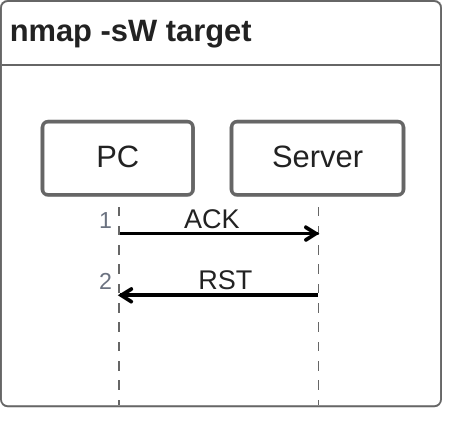

​	同样，**对没有防火墙的 Linux 系统发起 TCP 窗口扫描也不会提供太多信息**。正如我们在下面的控制台输出中看到的，与之前执行的 ACK 扫描相比，对没有防火墙的 Linux 服务器进行的窗口扫描结果没有提供任何额外信息。

```shell
pentester@TryHackMe$ sudo nmap -sW 10.10.4.173

Starting Nmap 7.60 ( https://nmap.org ) at 2021-08-30 10:38 BST
Nmap scan report for 10.10.4.173
Host is up (0.0011s latency).
All 1000 scanned ports on ip-10-10-252-27.eu-west-1.compute.internal (10.10.252.27) are closed
MAC Address: 02:45:BF:8A:2D:6B (Unknown)

Nmap done: 1 IP address (1 host up) scanned in 1.60 seconds
```


​	然而，正如你所预期的，如果我们对防火墙后的服务器重复进行 TCP 窗口扫描，我们期望得到更令人满意的结果。在下面显示的控制台输出中，TCP 窗口扫描指出有三个端口被检测为关闭。（这与将同三个端口标记为未过滤的 ACK 扫描形成对比。）虽然我们知道这三个端口并未关闭，但我们意识到它们的响应不同，表明防火墙并未阻止它们。

```shell
pentester@TryHackMe$ sudo nmap -sW 10.10.4.173

Starting Nmap 7.60 ( https://nmap.org ) at 2021-09-07 11:39 BST
Nmap scan report for 10.10.4.173
Host is up (0.00040s latency).
Not shown: 997 filtered ports
PORT    STATE  SERVICE
22/tcp  closed ssh
25/tcp  closed smtp
80/tcp  closed http
MAC Address: 02:78:C0:D0:4E:E9 (Unknown)

Nmap done: 1 IP address (1 host up) scanned in 14.84 seconds
```


# Custom Scan  自定义扫描

如果您想尝试**内置 TCP 扫描类型之外的新 TCP 标志组合**，可以**使用` --scanflags`** 。例如，如果您想**同时设置 SYN、RST 和 FIN**，可以**使用 --scanflags RSTSYNFIN** 。如下面的图所示，如果您开发自定义扫描，您需要了解不同端口的行为，以便在不同场景中正确解释结果。

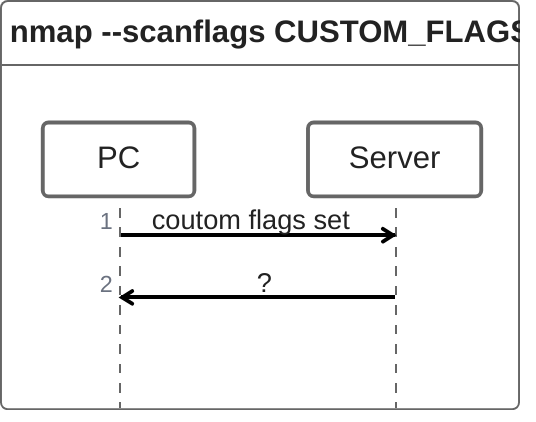

```shell
sudo nmap --scanflags RST target  // 设置了RST数据包模式
```

​	最后，必须注意的是，ACK 扫描和窗口扫描在帮助我们绘制防火墙规则方面非常有效。然而，重要的是要记住，**仅仅因为防火墙没有阻止某个特定端口，并不一定意味着该端口上有服务在监听**。例如，防**火墙规则可能需要更新以反映最近的服务变更。因此，ACK 和窗口扫描揭示的是防火墙规则，而不是服务。**

