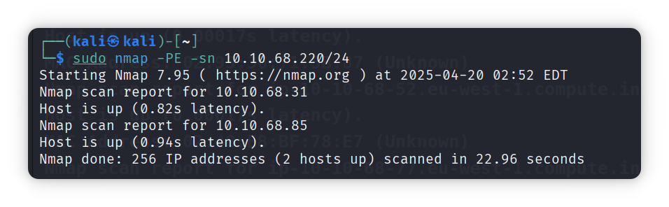
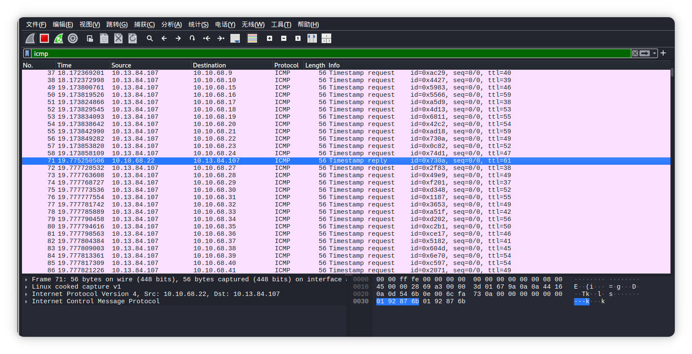

[TOC]

**原理：**查看谁对我们的请求做出了回应，通过是否有回应来判断主机是否存活

## ICMP回显请求

```shell
sudo nmap [option] target
--- PE    使用ICMP回显请求发现在线主机
--- sn    不进行端口探测

sudo nmap -PE -sn 192.168.1.12/24
# 向子网上的每个IP地址发送ICMP回显数据包

nmap -PE -sn target
PC1 ---(ICMP Echo Request)--> Server
		||
	如果主机存活返回以下数据
		||
		\/
PC1 <---(ICMP Echo Reply)--- Server
```



> [!NOTE]
>
> 新版的微软 Windows 默认配置了主机防火墙，阻止 ICMP 回显请求


​	上面的图中之所以会出现mac地址是因为之前已经通过ARP协议对每个主机的mac地址进行探测，所以在使用ICMP回显会直接返回之前便获取了的数据。

> [!CAUTION]
>
> 有许多的Wireshark图并未进行展示，可以自己去测试,然后观察info


## ICMP时间戳判断系统是否在线

```shell
nmap [option] target
--- PP 使用ICMP时间戳请求

nmap -PP -sn 10.10.68.220/24
# 使用ICMP时间戳的方法来发现目标机器子网中的在线计算机
# 不探测端口(sn)


nmap -PP -sn target
PC1 ---(ICMP Timestamp Request)--> Server
		||
	如果主机存活返回以下数据
		||
		\/
PC1 <---(ICMP Timestamp Reply)--- Server
```


- 此扫描向目标子网中的每个有效IP地址发送大量的ICMP时间戳请求



- 从上图中可以观察`into`列表中的信息，requests为发送数据,reply为回答(应答).


## 使用地址掩码查询查询是否收到地址掩码回复

```shell
nmap [option] target 
--- PM 使用地址掩码查询

sudo nmap -PM -sn 10.10.68.220/24
# 使用地址掩码查询发现活动主机，并且不进行端口探测

nmap -PM -sn target
PC1 ---(ICMP Address Mask Request)--> Server
		||
	如果主机存活返回以下数据
		||
		\/
PC1 <---(ICMP Address Mask Reply)--- Server
```


- 之所以会出现上面的情况是因为目标系统或路径上的防火墙阻止了这种类型的 ICMP 数据包
- 之所以不去怀疑他们的主机是否存活是因为之前都已经探测出来8个存活主机了
