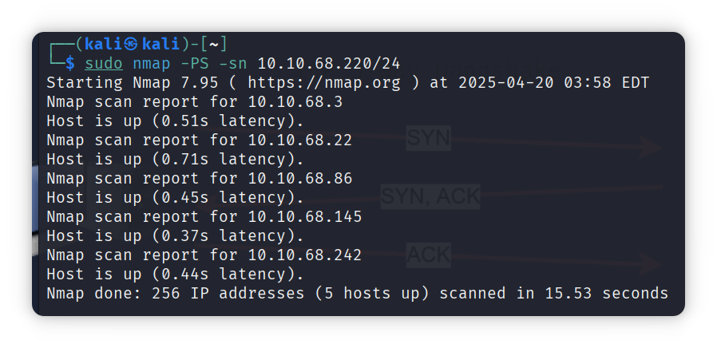
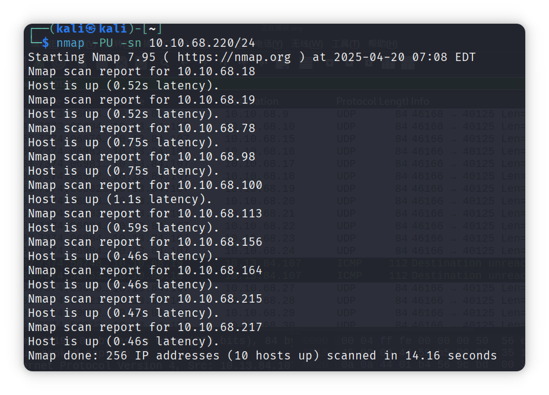
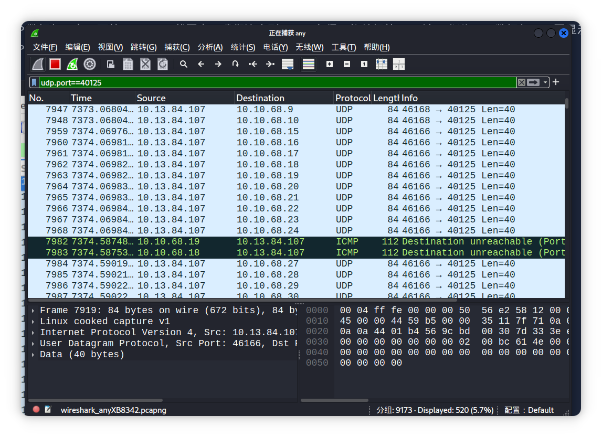

[TOC]


## TCP SYN Ping 

**原理：**发送一个设置了 SYN（同步）标志的数据包到 TCP 端口，默认是 80，并等待响应。**开放的==端口==应回复 SYN/ACK（确认）**；**关闭的端口则会返回 RST（重置）**。如果有==**响应就代表着主机存活**==

```shell
nmap [option] target
--- PS    使用TCP SYN Ping,并且可以在后面跟上端口号、范围、列表或他们的组合来实现。
示例:
---- PS21-25   针对端口21,22,23,24,25
---- PS80,443,8080  针对8080、80、443端口

nmap -PS -sn target
	PC ----SYN---> Server
判断主机是否存活
~  存活   PC <---SYN,ACK----Server
         ||
         ||
         \/              | 端口开放 ACK-----|
         PC ----{两种情况|				   | -->Server
					   | 端口不开放 RST---|
~  不存活   直接结束
				 
```




两图对照可以看出红色的返回了RST数据包，所以就代表着这个主机存活(他都能够响应了，还能回复RST数据包了，还不够证明这个主机存活吗？)

> [!CAUTION]
>
> 有特权的用户可以发送TCP SYN数据包，即使端口开放也不需要完成三次握手。无特权用户如果端口开放，则必须完成三次握手


## TCP ACK Ping

**原理：**直接**发送一个==设置了ACK(确认)标志==的数据包**，==必须使用特权用户==运行Nmap才能完成此操作，**非特权用户将尝试进行三次握手**.

**自我理解：**

TCP连接：SYN(同步) =-=> SYN(同步)/ACK(确认)  =-=> ACK(确认)                         当**服务器端在接收到ACK数据包**的时候，会**认为自己并未进行同步**，就会**返回一个RST**(重置)数据包。

```shell
nmap [option] target
--- PA   选择使用发送ACK标志数据包来进行主机存活探测

nmap -PA -sn target
PC ---ACK----> Server
||            
主机存活  ==不存活==>  直接不返回数据包
||
\/
PC <----返回RST--- Server
```


对照上面两个图可以知道，一旦返回了RST数据包则代表主机存活。


## UDP Ping

**原理：**==**发送UDP数据包到开放端口通常不会收到任何回复**==。但是==**发送UDP数据包到关闭的UDP端口**==，预计==**会收到一个ICMP端口不可达的数据包**==，这==表明系统处于运行状态且可用==。

```shell
nmap [option] target
--- PU 使用UDP ping

nmap -PU -sn target
PC ---UDP Packet---> Server
||
主机存活 | 主机不存活  ==> 数据包丢失，直接跳过
||
open port | port is close ==>Server== ICMP Type3,Code3 ==> PC
||
\/
服务器接收数据，但是不返回任何数据(UDP协议)
```





从上面两个图中可以得出信息，一旦在他们之间出现了ICMP协议数据内容，则代表着他们之间进行了数据交流，那么也就代表着主机存活


## Messcan

Masscan 使用类似的方法来发现可用的系统为了快速完成网络扫描，Masscan 对生成的数据包速率相当激进。

语法非常相似： -p 后面可以跟端口号、列表或范围。请参考以下示例：