[TOC]

## 在Linux系统中，发送原始套接字数据包需要root权限，因为创建原始套接字需要CAP_NET_RAW能力。

## TCP and UDP Ports

与 IP 地址在众多网络主机中指定某一主机的方式相同，==TCP 端口或 UDP 端口用于识别该主机上运行的网络服务==。

==服务器提供网络服务==，并==遵循特定的网络协议==。示例包括提供时间、响应 DNS 查询和提供网页服务。

​	==端口通常与使用该特定端口号的服务相关联==。例如，==HTTP 服务器==默认绑定到 ==TCP 端口 80==；此外，如果==HTTP 服务器支持 SSL/TLS==，则会==监听TCP 端口 443==。（**TCP 端口 80 和 443 是 HTTP 和 HTTPS 的默认端口**；不过，网站管理员在必要时也可能选择其他端口号。）此外，在**同一 IP 地址**上，**任何 TCP 或 UDP 端口最多只能有一个服务监听**。

**端口分为两种状态:** 

- **开放端口**表示该**端口有某个服务在监听**
- **关闭端口**表示该**端口没有服务在监听**

**Nmap有以下六种状态：**

- open : 表示有**服务正在指定端口上监听**，该端口**可访问**。端口可达，并**未被防火墙或其他安全设备/程序阻止**
- close : 表示**没有服务在端口上监听**，该**端口是可以访问的**。这也意味着端口**是可达的**，且并**未被防火墙或其他安全设备/程序阻止**。
- filrered : 表示Nmap**无法确定端口是开放还是关闭**，因为该端口**不可访问**。此状态通常是由**防火墙阻止Nmap访问该端口**。Nmap的数据包可能**被阻止到达该端口**；或者**响应被阻止返回到Nmap的主机**。
- Unfitered : 表示Nmap**无法确定端口是开放还是关闭**，尽管**端口是可访问的**。此状态通常在使用ACK扫描时遇到`-sA`。
- open | Filtered : 这意味着Nmap**无法确定端口是开放还是被过滤**。
- close | Filtered : 这意味着Nmap**无法确定端口是关闭还是被过滤**。

### 答题: 

- 哪个服务默认使用UDP端口53？

​	 ==DNS==

> [!IMPORTANT]
>
> **DNS**是一个**将域名转换为**与之相关联的**IP地址的系统**，允许用户通过易记的域名访问互联网资源，而不需要记住每个资源的IP地址。
>
> 关于UDP **53端口**的详细解释： 
>
> 一、UDP **53端口**的作用 域名解析：UDP **53端口**是DNS服务器与DNS客户端之间进行域名解析的通信端口。 
>
> 当您尝试访问一个网站时，您的计算机会向DNS服务器发出查询请求，该请求包含您想要访问的域名
>
> [点我看详细信息][https://www.cbtnuggets.com/common-ports/what-is-port-53]

- 哪个服务默认使用TCP端口22？

 SSH

> [!IMPORTANT]
>
> 安全外壳协议（Secure Shell Protocol，简称SSH）是一种加密的网络传输协议，可在不安全的网络中为网络服务提供安全的传输环境[1]。SSH通过在网络中建立安全隧道来实现SSH客户端与服务器之间的连接[2]。SSH最常见的用途是远程登录系统，人们通常利用SSH来传输命令行界面和远程执行命令。
>
> [详细内容打开左边的连接]: https://zh.wikipedia.org/wiki/Secure_Shell
> [https://zh.wikipedia.org/zh-cn/Keepalive]: 

## TCP Flags

​	Nmap 支持不同类型的 TCP 端口扫描。要理解这些端口扫描之间的区别，我们需要回顾 TCP 头部。

​	TCP 头部是 TCP 段的前 24 个字节。下图显示了 RFC 793 中定义的 TCP 头部。这个图乍一看很复杂；然而，它其实很容易理解。

​	在第一行，我们有**源 TCP 端口**号和目标端口号。我们可以看到端口号分配了 16 位（2 字节）。在第二行和第三行，我们有序列号和确认号。每行分配了 32 位（4 字节），共六行，总计 24 字节。

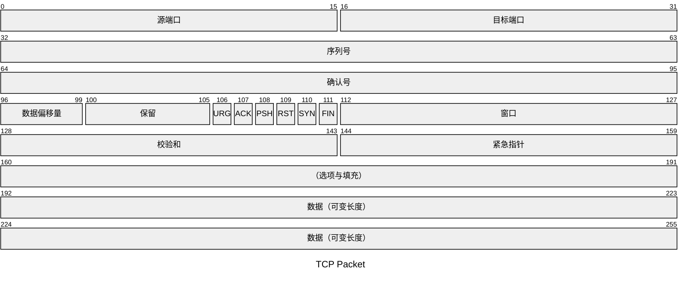

需要关注 Nmap 可以设置或取消设置的标志位。设置标志位意味着将其值设为 1。从左到右，**TCP 头部的标志位依次是：**

- URG：**紧急标志**表示紧急指针字段是重要的。紧急指针指示传入数据是紧急的，且带有 URG 标志的 TCP 段会被立即处理，而无需考虑等待之前发送的 TCP 段。
- ACK：确认标志表示确认号是有效的。它用于确认已收到的 TCP 段。
- RST：重置标志用于重置连接。其他设备，如防火墙，可能会发送此标志以断开 TCP 连接。当数据发送到主机且接收端没有服务响应时，也会使用此标志。
- SYN：同步标志用于启动 TCP 三次握手并与另一主机同步序列号。序列号应在 TCP 连接建立时随机设置。
- FIN：**发送方没有更多数据要发送**。
- PSH：推送标志，要求TCP立即将数据传递给应用程序。

## TCP 连接扫描

正常的TCP链接是三次握手来建立连接，而使用nmap在连接之后会直接断开连接。

下图是`nmap`观察TCP 端口是否开放，而不是建立 TCP 连接。因此，一旦通过发送 RST/ACK 确认了连接状态，连接就会被断开。(可用于端口探测和主机存活探测)

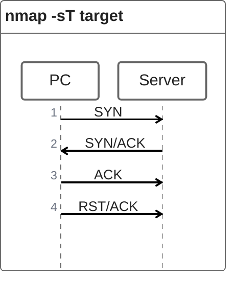

> [!WARNING]
>
> **使用TCP连接扫描是非特权用户发现开放TCP端口的唯一可能选项。**

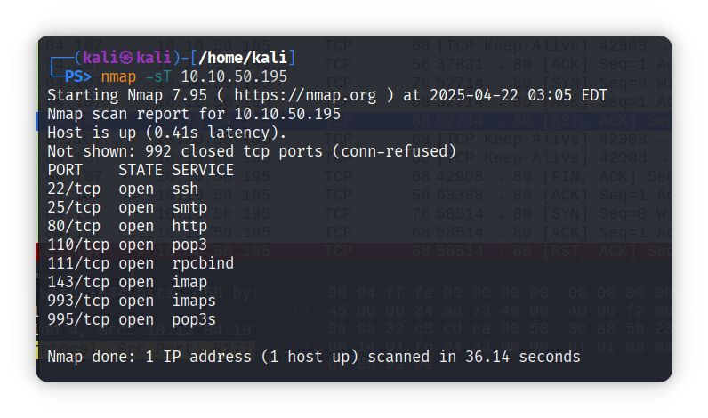

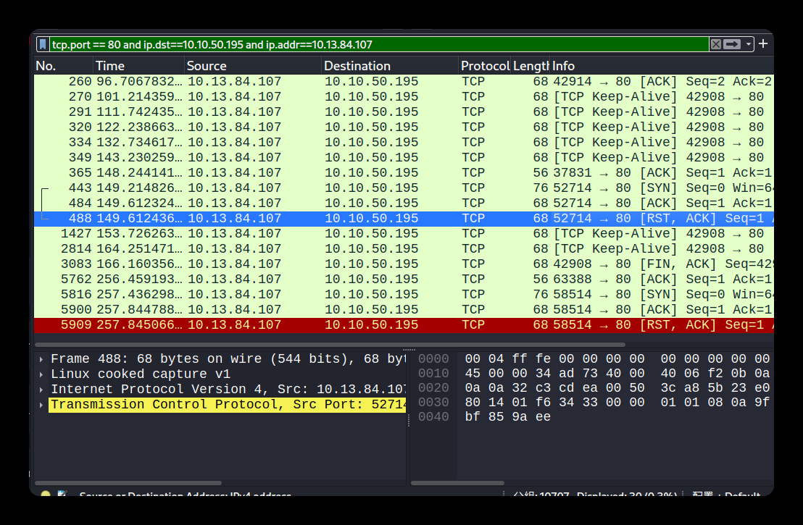

- 上面两图可以看出，红色那一行返回的数据包为RST、ACK数据包，也就代表着此端口是开放状态的。

> **传输控制协议存活(TCP Keep-Alive)包为可选特性**，且**默认关闭**。存活包内**没有数据**。在以太网网络中，存活包的大小为最小长度的几帧（64字节）。协议中，还有三个与存活包相关的参数：
>
> - **存活时长**（英语：Keepalive time）即空闲时，两次传输存活包的持续时间。TCP存活包时长可手动配置，默认不少于2个小时。
> - **存活间隔**（英语：Keepalive interval）即未收到上个存活包时，两次连续传输存活包的时间间隔。
> - **存活重试次数**（英语：Keepalive retry）即在判断远程主机不可用前的发送存活包次数。当两个主机透过TCP/IP协议相连时，TCP存活包可用于判断连接是否可用，并按需中断。
>
> [引用]: https://zh.wikipedia.org/zh-cn/Keepalive

**下图有解析:**

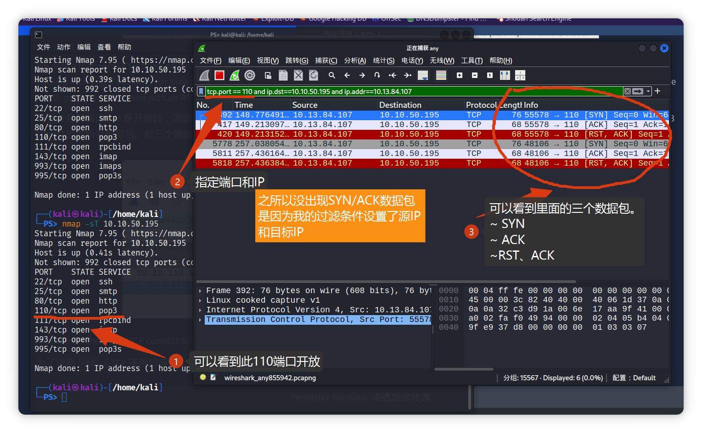

## TCP SYN Scan(TCP SYN 扫描)

==非特权用户仅限于连接扫描==

**SYN扫描不需要完成TCP三次握手。当他收到服务器的响应会立即断开连接。并且还需要特权用户来运行**(因为非特权用户会执行完整的三次握手)

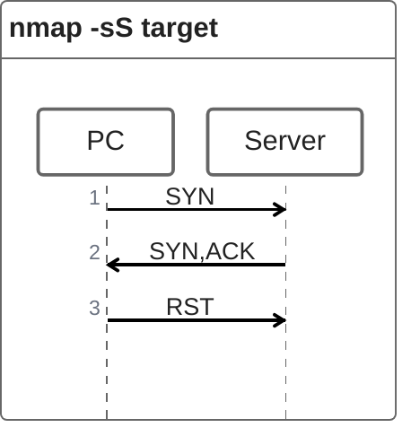

接收到SYN/ACK数据包立即返回RST数据包，并且对数据进行记录。

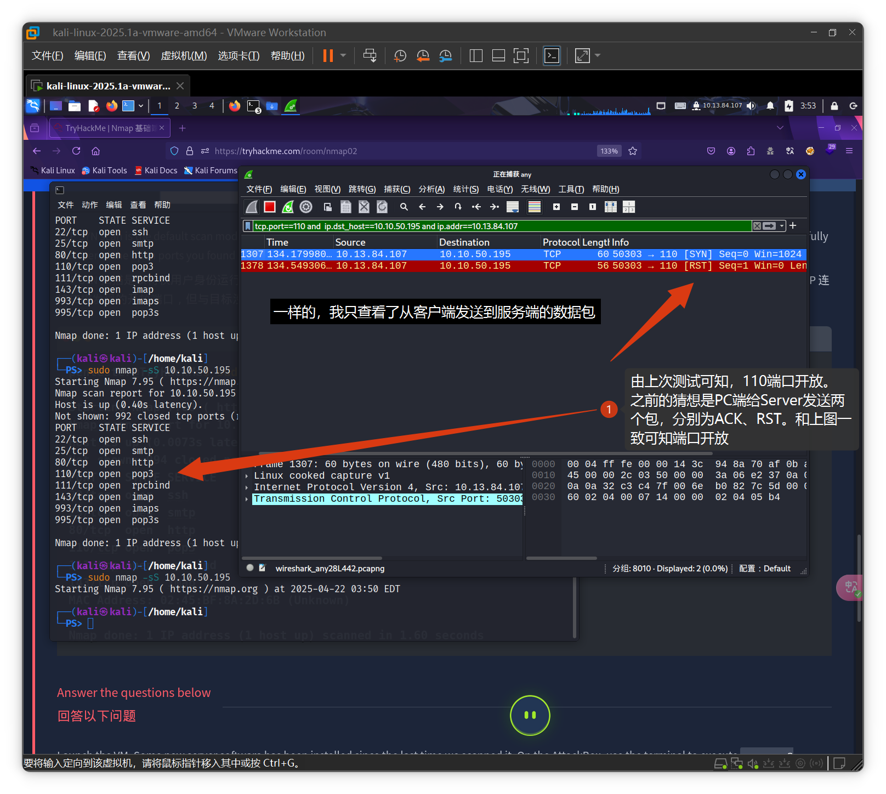

==不使用**特殊用户**来使用SYN扫描会执行三次握手操作，也就会导致SYN扫描变成了TCP握手扫描，所以一定需要使用特殊权限来进行SYN扫描。==(这是我的个人猜测，使用AI进行的验证，不一定正确。)

## UDP Scan(UDP扫描)

UDP 是一种==无连接协议==，因此它==不需要任何握手来建立连接==。我们无法==保证监听 UDP 端口的服务会响应我们的数据包==。然而，如果==向关闭的端口发送 UDP 数据包==，会==返回一个 ICMP 端口不可达错误（类型 3，代码 3）==。您可以==使用 `-sU` 选项选择 UDP 扫描==；此外，您还可以将其==与其他 TCP 扫描结合使用==。

#### **端口不开放：**

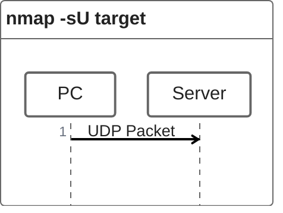

#### **端口开放：**

#### 我们期望收到一个类型为 3（目的地不可达）、代码为 3（端口不可达）的 ICMP 数据包。换句话说，不产生任何响应的 UDP 端口将被 Nmap 标记为开放。

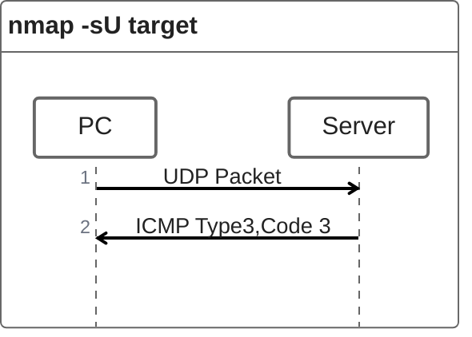

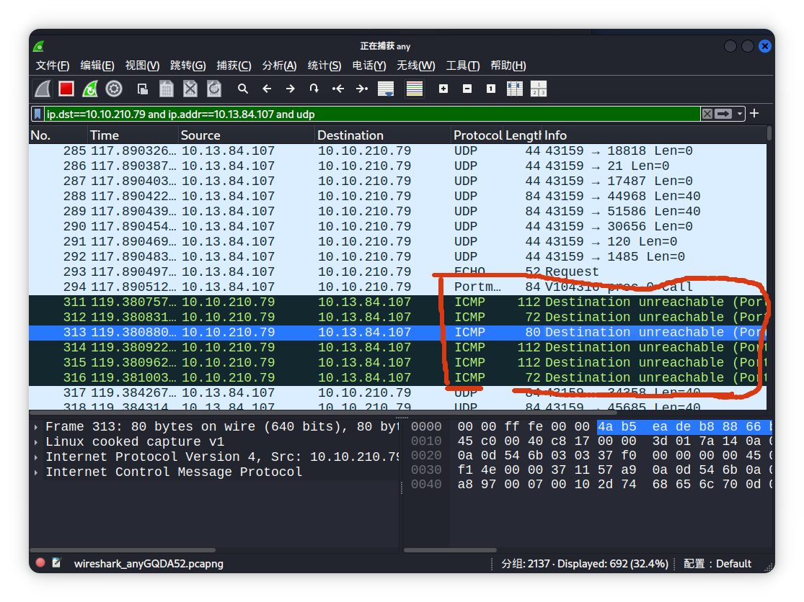

根本扫不动 = =

使用下面这串命令扫描更快

-F使得扫描端口只会扫描前1000端口，而-v就是更新

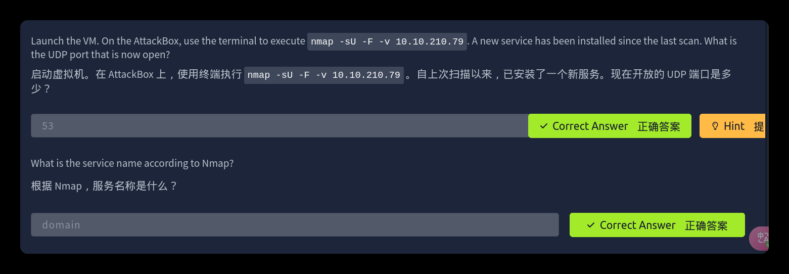

## 微调范围和性能

您可以指定要扫描的端口，而不是默认的 1000 个端口。现在指定端口已经很直观了。让我们来看一些例子：

    端口列表： -p22,80,443 将扫描端口 22、80 和 443。
    端口范围： -p1-1023 将扫描 1 到 1023（含）之间的所有端口，而 -p20-25 将扫描 20 到 25（含）之间的端口。

您可以使用 -p- 请求扫描所有端口，这将扫描所有 65535 个端口。如果您想扫描最常见的 100 个端口，添加 -F 。使用` --top-ports `10 将检查最常见的十个端口。

您可以使用 -T<0-5> 控制扫描时间。 -T0 是最慢的（偏执模式），而 -T5 是最快的。根据 Nmap 手册页，有六个模板：

    偏执模式 (0)
    偷偷摸摸 (1)
    礼貌模式 (2)
    正常 (3)
    激进 (4)
    疯狂 (5)

为了避免 IDS 警报，您可以考虑使用 `-T0 `或 `-T1` 。例如， -T0 一次扫描一个端口，并在发送每个探测之间等待 5 分钟，因此您可以猜测扫描一个目标完成需要多长时间。如果您没有指定任何时间，Nmap 会使用正常的`-T3` 。请注意，` -T5` 在速度方面是最激进的；然而，这可能会影响扫描结果的准确性，因为丢包的可能性增加。请注意， -T4 通常在 CTF 和学习在练习目标上扫描时使用，而 -T1 通常在真实任务中使用，在那里隐蔽性更为重要。

或者，您可以选择使用 `--min-rate <number> `和 `--max-rate <number> `来控制数据包速率。例如，` --max-rate 10 `或 `--max-rate=10 `确保您的扫描器每秒发送的数据包不超过十个。

此外，您可以使用 `--min-parallelism <numprobes> `和 `--max-parallelism <numprobes>` 控制探测并行化。Nmap 探测目标以发现哪些主机在线以及哪些端口开放；探测并行化指定可以并行运行的此类探测数量。例如，` --min-parallelism=512` 促使 Nmap 保持至少 512 个并行探测；这 512 个探测与主机发现和开放端口相关。

# 总结：

本房间涵盖了三种类型的扫描。

| 端口扫描类型 |          示例命令          |
| :----------: | :------------------------: |
| TCP 连接扫描 |   nmap -sT 10.10.210.79    |
| TCP SYN 扫描 | sudo nmap -sS 10.10.210.79 |
|   UDP 扫描   | sudo nmap -sU 10.10.210.79 |

 	
 	
 	
	

这些扫描类型可以帮助您开始发现目标主机上运行的 TCP 和 UDP 服务。

|         选项          |           目的            |
| :-------------------: | :-----------------------: |
|          -p-          |         所有端口          |
|       -p1-1023        |    扫描端口 1 到 1023     |
|          -F           |    100 个最常见的端口     |
|          -r           |      按顺序扫描端口       |
|        -T<0-5>        | -T0 是最慢的，T5 是最快的 |
|     --max-rate 50     |     速率 <= 50 包/秒      |
|     --min-rate 15     |     速率 >= 15 包/秒      |
| --min-parallelism 100 |  至少 100 个探针并行运行  |

​	
​	
​	
 	
 	
 	
 	
​	
 	
